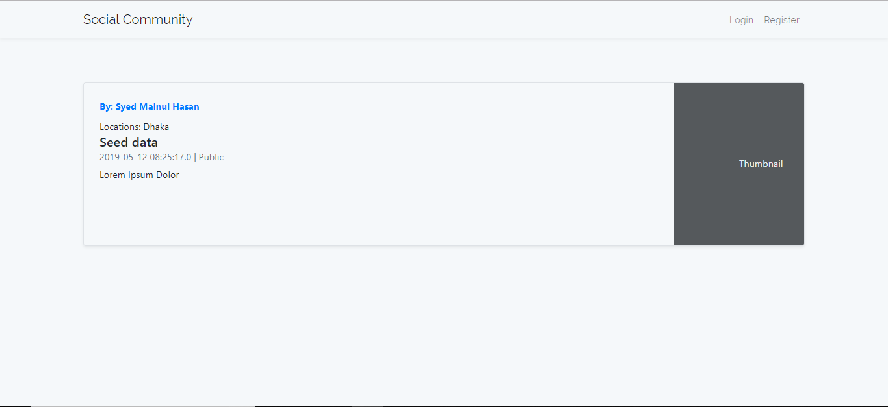

## Social-community is a small social openion sharing application aimed at fulfilling the following requirements.
1. Site user can register and login to the applicaiton.
2. Once logged in, he can share a status to public or private selecting a location (Using dropdown).
3. Status can be public or private.
4. Public status will be visible to all other users within the selected location. However, private status will be visible to only the user who posted.
5. Owner of a shared status can edit or delete it if he wishes.

### Setup Process:
1. The application is a Maven project. Therefore, Maven must have to present in the dev environment.
2. The application is developed with Intellij Idea. Therefore, it is preferred to use intellij for importing easily.
3. The development environment JDK version is JDK 8
5. Database is MySQL. DB username is **root** and password is **''** [Empty]. If the connection is properly configured, database will be created and initialized with seed data automatically.

## Completed checkpoints:
1. Register and login

2. Create, update location

3. Create, update, delete status

4. Public status are visible to everyone, private are only visible to owner.

Example:
Public page:

Same page accessed by logged in user:

5. Form fields are validated both in client and server side.
Example:
Registration page:

## Could not perform:
1. Updating oneToMany with HQL

## Further enhancements:
1. Updating one to many
2. Allowing to upload attachments
3. Comment and reactions.
